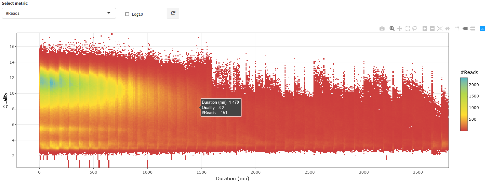

 ---
# BoardION

BoardION is an interactive web application for real-time monitoring of ONT sequencing runs. BoardION is dedicated to sequencing platforms, the interactive interface of BoardION allows users to easily explore sequencing metrics and optimize the quantity and the quality of the generated data during the experiment. It also enables the comparison of several flowcells to evaluate the library preparation protocols or the quality of input samples.

A demo of BoardION is available [here](https://boardion.genoscope.cns.fr/).

## Documentation

[Installation](docs/installation.md)

[Usage](docs/usage.md)

[Interface description](docs/ui.md)

---

---

